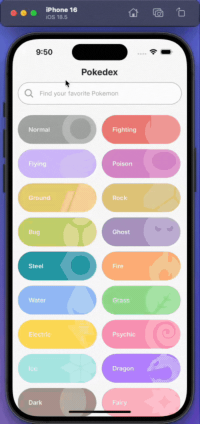

# Pokedex app

Una aplicación móvil para explorar y buscar información sobre Pokémon, construida con React Native y Expo.

## Características

- 📱 Lista de Pokémon con scroll infinito
- 🔍 Búsqueda de Pokémon
- 📊 Detalles de cada Pokémon (stats, evoluciones, etc.)
- 🎨 Diseño moderno y responsive
- ⚡ Rendimiento optimizado

## 📚 Requerimientos

- Tener instalado [**Git**](https://git-scm.com/) para clonar este repositorio
- Tener [**Node.js**](https://nodejs.org/en/) instalado
- Un dipositivo iOS o Android con la app de [**Expo GO**](https://expo.dev/go) instalada
- Un simulador de iOS o un emulador de Android instalado

## 🚀 Empezar

1. Clonar repositorio

   ```bash
   git@github.com:ser-emejia/bankaya-challange-app.git
   ```

2. Instalar dependencias

   ```bash
   npm install
   ```

3. Correr la aplicación

   ```bash
   npx expo start
   ```

En el output, encontrarás la opción para abrir la app en:

- [Expo Go](https://expo.dev/go)

## Demo

<h1 align="center">
  
  
</h1>
